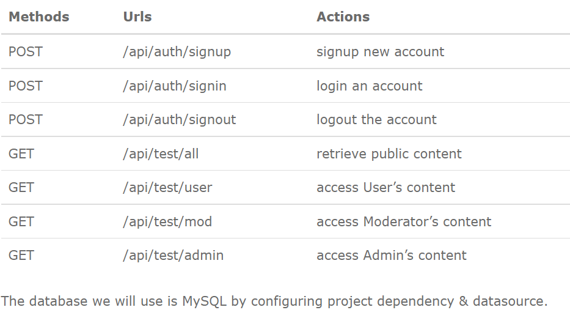
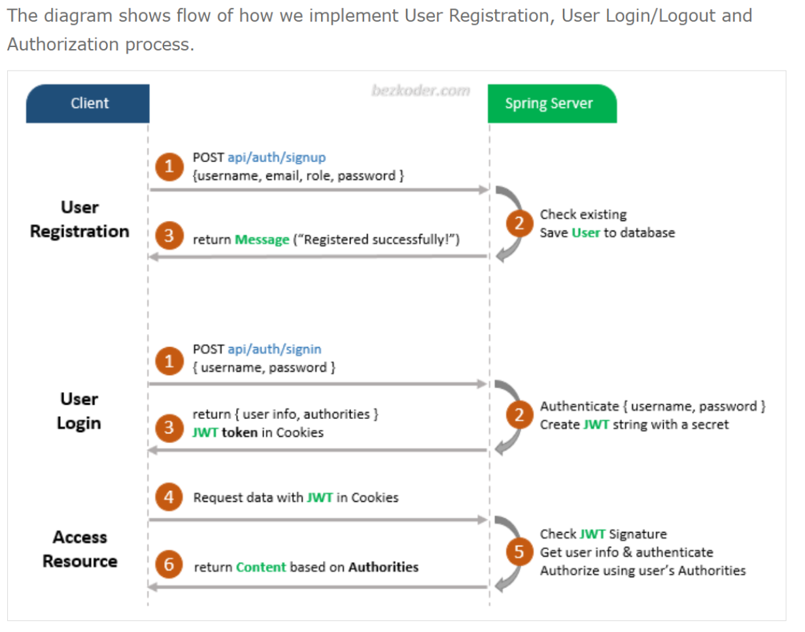
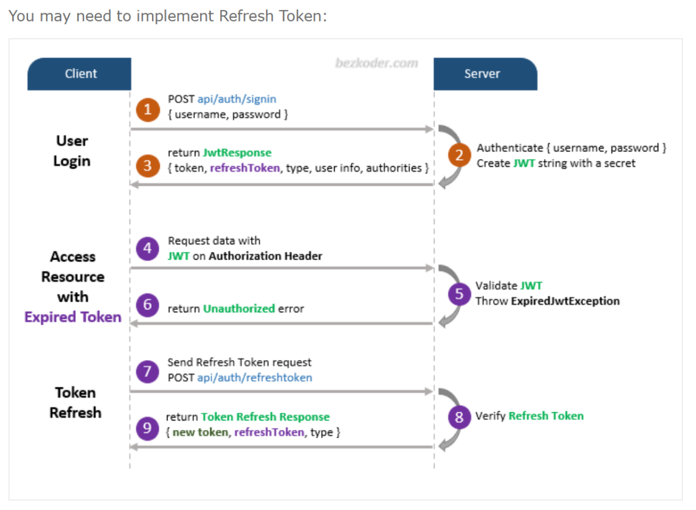
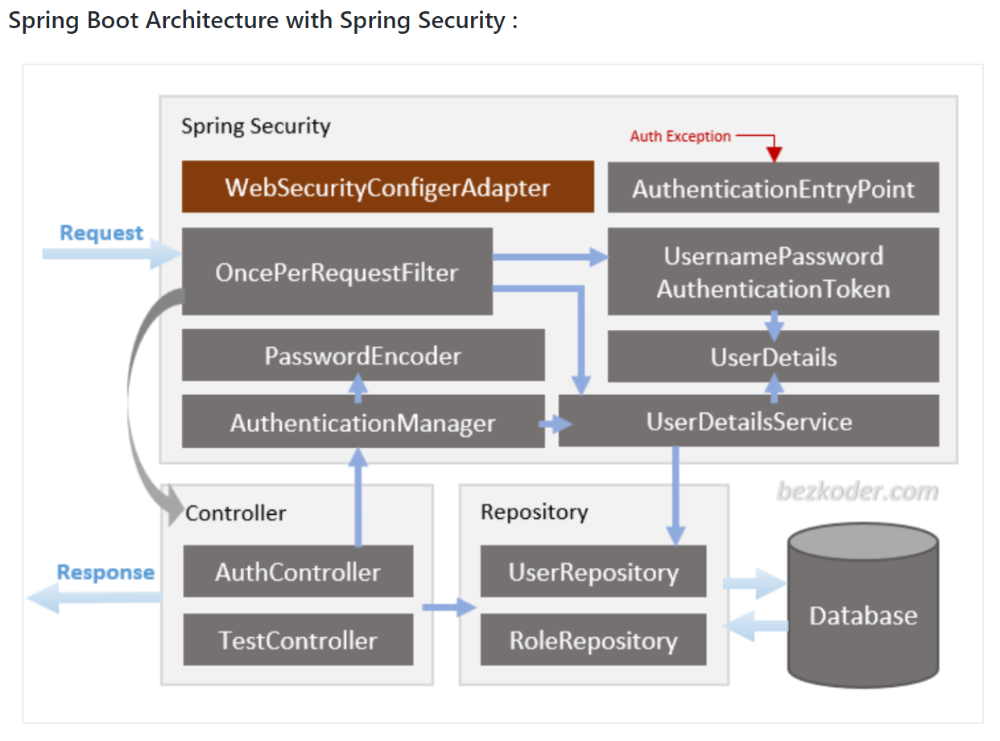

# Spring-Boot-Security-MySQL-Jwt-Authentication
### Build a Spring Boot, Spring Security: Login and Registration example (Rest API) that supports JWT with HttpOnly Cookie working with MySQL Database.
### Goals :
#### Appropriate Flow for User Login and Registration with JWT and HttpOnly Cookie
#### Spring Boot Rest Api Architecture with Spring Security
#### How to configure Spring Security to work with JWT
#### How to define Data Models and association for Authentication and Authorization
#### Way to use Spring Data JPA to interact with MySQL Database

### Overview :
#### build a Spring Boot + Spring Security application with JWT in that:
#### User can sign up new account (registration), or login with username & password.
#### By User’s role (admin, moderator, user), we authorize the User to access resources.

### APIs :

### Flow of Spring Boot Security Login example:

### Note* : A legal JWT will be stored in "HttpOnly Cookie" if Client accesses protected resources.

#### More details at: Spring Boot Refresh Token with JWT example : https://www.bezkoder.com/spring-boot-refresh-token-jwt/

### Spring Boot Architecture with Spring Security :

### Spring Security :
#### – WebSecurityConfigurerAdapter is the crux of our security implementation.
#### – It provides HttpSecurity configurations to configure cors, csrf, session management, rules for protected resources.

#### We can also extend and customize the default configuration that contains the elements below.
#### – `UserDetailsService` interface has a method to load User by username and returns a `UserDetails object` that Spring Security can use for authentication and validation.
#### – `UserDetails` contains necessary information (such as: username, password, authorities) to build an Authentication object.
#### – `UsernamePasswordAuthenticationToken` gets {username, password} from `login Request`, `AuthenticationManager` will use it to authenticate a `login account`.
#### – `AuthenticationManager` has a `DaoAuthenticationProvider` (with help of `UserDetailsService` & `PasswordEncoder`) to validate `UsernamePasswordAuthenticationToken object`.
##### If successful, `AuthenticationManager` returns a fully populated `Authentication object` (including granted authorities).
#### – `OncePerRequestFilter` makes a single execution for each request to our API.
#### It provides a `doFilterInternal()` method that we will `implement parsing` & `validating JWT`, `loading User details (using UserDetailsService)`,
#### checking `Authorization`(using `UsernamePasswordAuthenticationToken`).
#### – `AuthenticationEntryPoint` will `catch authentication error`.

### Repository : has interfaces that extend Spring Data JPA JpaRepository to interact with Database.
#### Repository contains `UserRepository` & `RoleRepository` to work with `Database`, will be imported into `Controller`.

### Models : 
#### Defines two main models for Authentication (User) & Authorization (Role). They have many-to-many relationship.
#### ● User : id, username, email, password, roles
#### ● Role : id, name

### Payload : 
#### Defines classes for `Request` and `Response` objects
#### We also have `application.properties` for configuring Spring Datasource, Spring Data JPA and `App properties` (such as `JWT Secret string` or `Token expiration time`).

### Controller : handle signup/login requests & authorized requests
#### `Controller` receives and handles request after it was filtered by `OncePerRequestFilter`.
#### – `AuthController` handles signup/login requests --> @PostMapping(‘/signup’), @PostMapping(‘/signin’), @PostMapping(‘/signout’)
#### – `TestController` has accessing protected resource methods with `role` based validations.
#### --> @GetMapping(‘/api/test/all’), @GetMapping(‘/api/test/[role]’)

#### Note* : Understand the architecture deeply and grasp the overview easier:
##### Spring Boot Architecture for JWT with Spring Security= https://www.bezkoder.com/spring-boot-jwt-mysql-spring-security-architecture/

### Technology :
#### Java 8
#### Spring Boot 2.6.8 (with Spring Security, Spring Web, Spring Data JPA)
#### jjwt 0.9.1
#### MySQL latest Version
#### Maven 3.8.4

### Security :
#### Configure Spring Security & implement Security Objects
#### ● `WebSecurityConfig` extends `WebSecurityConfigurerAdapter`
#### ● `UserDetailsServiceImpl` implements `UserDetailsService`
#### ● `UserDetailsImpl` implements `UserDetails`
#### ● `AuthEntryPointJwt` implements `AuthenticationEntryPoint`
#### ● `AuthTokenFilter` extends `OncePerRequestFilter`
#### ● `JwtUtils` provides methods for `generating`, `parsing`, `validating JWT`

### Create Project and Run App:
#### 1.Create and Setup a new project(all dependencies needed) or clone the url GitHub 2.Configure the application.properties 3.Insert the date into tables(check the existence of the Database) 4.Run with command: mvn spring-boot:run or Run IDE, check the database: testdb_mysql_auth(create if not existing)

### Exécute the queries :
#### INSERT INTO roles(name) VALUES('ROLE_USER');
#### INSERT INTO roles(name) VALUES('ROLE_MODERATOR');
#### INSERT INTO roles(name) VALUES('ROLE_ADMIN');

### Add User
#### Postman: Post  -> http://localhost:8080/api/auth/signup

#### {"username": "modUyghur","email": "mod@uyghurjava.com","password": "12345678","role": ["mod", "user"]}

#### {"username": "userUyghur","email": "user@uyghurjava.com","password": "12345678","role": ["user"]}

#### {"username": "adminUyghur","email": "admin@uyghurjava.com","password": "12345678","role": ["admin","user"]}

#### If success: {"message": "User registered successfully!"}

### In DB : Table=users :
####            id         email                  password                                         username
####            1 mod@uyghurjava.com    $2a$10$BC6OBR7BiRLT1P7Q1evxUuMsyCTaHGJJLqXTFXT.bA3FdrWTA6zRa   modUyghur
####            2 user@uyghurjava.com   $2a$10$DOcc0cFu5QDu94GN6ef88..UugSx9AmXcE8xHg7hgS8/ydZILvSb.   userUyghur
####            3 admin@uyghurjava.com  $2a$10$1KZATjOD63z2LriZVSFhy.JIwRWQvmidjZUDUx8Hh49N/zIcWP/ha   adminUyghur

### Collection: all requests (in Postman folder)

### Methods:
#### 1.addRoleToUser(Param), 2.profile(Principal principal), 3.showAllUsers(), 4.refreshToken() --> wait to update
### Other references :
#### Data.sql, screencast photos in dataInfo folder

### Note* :  Sources of all codes, texts and the images from the website:

### Source: https://www.bezkoder.com/spring-boot-login-example-mysql/

#### Thank you very much for this excellent tutorial of www.bezkoder.com !
